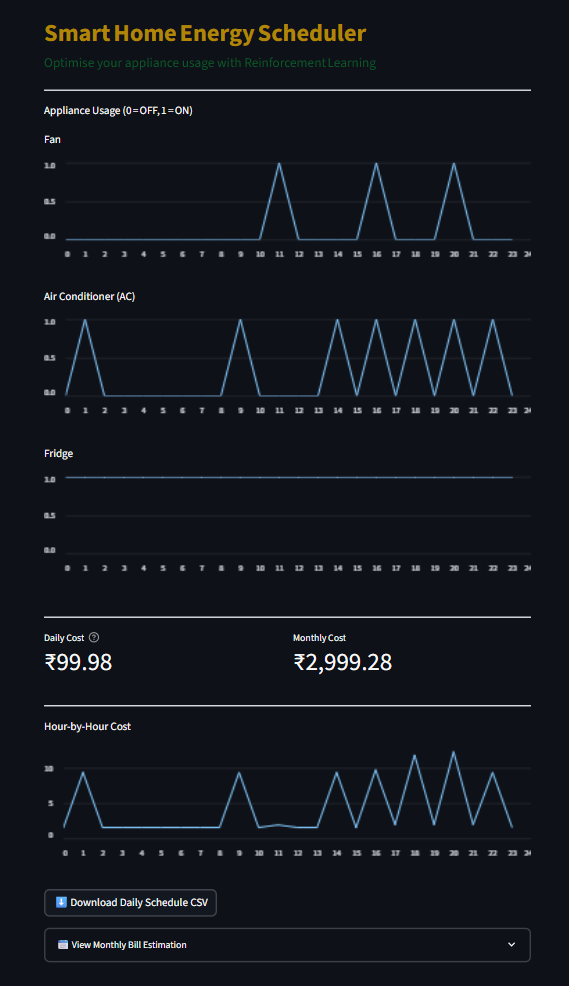

  

# Smart Home Energy Scheduler using Reinforcement Learning (RL)

This project uses Reinforcement Learning to minimize electricity costs by intelligently scheduling the operation of home appliances like fans, ACs, and refrigerators.

## Features
- RL-based appliance scheduling with PPO algorithm
- Realistic power rating and energy cost calculation
- Fridge is always ON, while Fan and AC are controlled intelligently (more devices can be added and further changes can be made)
- Dynamic pricing for peak and off-peak hours
- Streamlit dashboard with charts and download options
- Monthly bill estimation using realistic slab-based rates

## Folder Structure
├── dashboard/         # Streamlit app UI

├── models/            # Trained RL models (e.g., ppo_smart_home.zip)

├── results/           # Generated CSV schedules for analysis

├── train_agent.py     # Script to train the PPO agent

├── evaluate_agent.py  # Evaluate and get schedule from model

├── smart_home_env.py  # Custom OpenAI Gym environment

└── README.md          # Project overview (this file)

## How it works
The PPO agent is trained in a Gym environment to learn when to turn appliances ON or OFF to minimize total electricity cost under dynamic pricing conditions. Fridge remains ON all day. Fan and AC usage is optimized.

